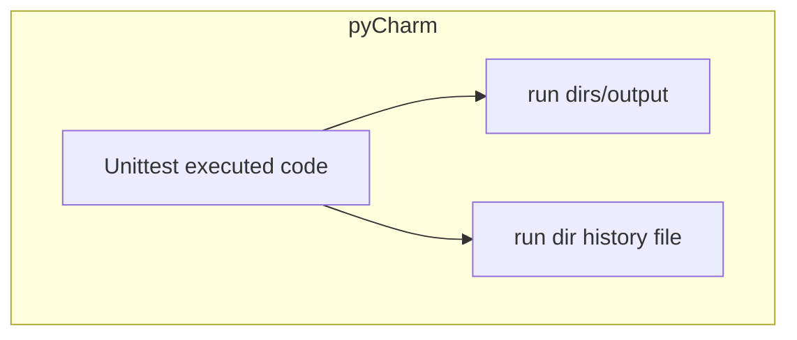

# AA203_project

The repo is the results of a project completed as part of the Stanford course AA203 : Optimal and Learning-Based Control. The original report from the course is in:
[Course report](/reports/final.pdf)
This report is slightly modified in that the code was originally included in the document.
Follow-up work on this project is documented in: [Follow-up course report](/reports/post_final.pdf)
The code supporting these reports is contained in this repo and described below.

## How the code works

Developing and refining sequential convex programming (SCP) to solve an optimal control problem for a parabolic, non-linear PDE involves a number of simulations (to understand the PDE) and time-consuming runs of the SCP process itself. There are many parameters involved, and much experimentation to understand and manipulate the convergence of SCP. While Jupyter notebooks are one solution to this problem, they do have their drawbacks in terms of code management, reproducibility and atomicity/grouping of operations. For this project, I took a different approach.

1. Execution of code is managed by the unittest framework, and each (atomic) test either performs a sequence of simulation and SCP steps, or runs a unit test (of course!) or a plotting test which validates function.
2. PyCharm is used to find and execute tests. This also provides debugging, plot management, code quality checks, etc.  One could also execute code with VScode, or just run specific unit tests from the command line.
3. Each simulation or SCP execution is saved to a unique run directory, managed and accessed by serialization and deserialization code. All simulation or SCP parameters are saved to the run directory. This makes is possible to keep track of and experiment with the effects of myriad parameters.
4. As simulation and SCP runs are made, a json file is generated which captures the latest run of a given class of run - say a collection of parameters. These json files contain the references to run directories for the inclusion of the results in a report. Note that each time a run is made, a large collection of plots and output are saved.
Another option here would be to append the latest run directory to the json file.

The code in this repo is also not in any sense of the word production code. It is experimental code used to develop and refine convergent SCP for the parabolic PDE involved. It's main intent is to manage lots of numerical experiments in a reproducible way. It also provides figures for related reports. One could argue this is a lot of overhead for what is accomplished.

A diagram of the functionality is as follows:

Note that each executed/updated code block is functionally named, as is the history file containing run directories. The run directories are uniquely named by run date and time.