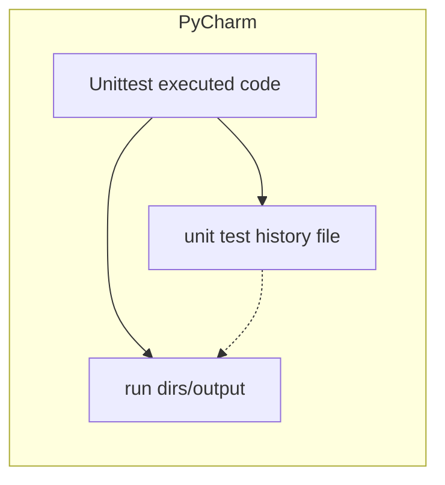

# AA203_project

The repo is the result of a project completed as part of the Stanford course AA203 : Optimal and Learning-Based Control. The original report from the course is in: [Course report](/reports/final.pdf).
This report is slightly modified in that the code was originally included in the document.
Follow-up work on this project is documented in: [Follow-up course report](/reports/post_final.pdf).
The code supporting these reports is contained in this repo and is described below. These reports are generated with LaTeX using TeXStudio on Windows 10. All TeXStudio droppings are included in the `reports` directory.

## Disclaimer
This project is an examination of methods of optimal control for a contrived agricultural scenario. It does not advocate for the use of pesticides or any other agricultural methods.

## How the code works

Developing and refining sequential convex programming (SCP) to solve an optimal control problem for a parabolic, non-linear PDE involves a number of simulations (to understand the PDE) and time-consuming runs of the SCP process itself. There are many parameters involved, and much experimentation to understand and manipulate the convergence of SCP. While Jupyter notebooks are one solution to this problem, they do have their drawbacks in terms of code management, reproducibility and atomicity/grouping of operations. For this project, I took a different approach, utilizing the unittest framework and PyCharm to manage multiple code entry points. Code cells in PyCharm and VScode perform a similar function, but are still not atomic. Since the LaTex/pdf reports (see above) are intended to communicate results, the jupyter notebook is less important as a vehicle for combining code and plots in a story. See some similar discussion at : [Alternative to Jupyter Notebooks](https://pbpython.com/notebook-alternative.html).

1. Execution of code is managed by the unittest framework, and each (atomic) test either performs a sequence of simulation and SCP steps, or runs a unit test (of course!) or a plotting test which validates function. In a sense, each "test" would be comparable to a cell in a Jupyter notebook. We are essentially using unittest/PyCharm to manage numerous code entry points implied by our development process.
2. PyCharm is used to find and execute tests. This also provides debugging, plot management, variable display/breakpoints, code navigation and quality checks, etc.  One could also execute code with VScode, or just run specific unit tests from the command line.
3. The output of each simulation or SCP execution is saved to a unique run directory, managed and accessed by serialization and deserialization code. All simulation or SCP parameters are saved to the run directory. This makes it possible to keep track of and experiment with the effects of myriad parameters.
4. As simulation and SCP runs are made, a json history file is generated which captures the latest run of a given class of run - say a collection of parameters. These json files contain the references to run directories for the inclusion of the results in a report. Note that each time a run is made, a possibly large collection of plots and output are saved. Another option here would be to append the latest run directory to the json file. In addition, this json history file is named in such a way to pair it with the test being run.

The code in this repo is also not in any sense of the word production code. It is experimental code used to develop and refine convergent SCP for the parabolic PDE involved. It's main intent is to manage lots of numerical experiments in a reproducible way. It also provides figures for related reports. One could argue this is a lot of overhead for what is accomplished.

A diagram of the functionality is as follows:

Note that each executed/updated code block is functionally named, as is the history file containing generated run directories. The run directories are uniquely named by run date and time. Typically, the code is modified and updated many times during development as implementation and parameters are tweaked. This approach saves all the runs made during development for later reference and comparison.

Many run directories were created during development and refinement of SCP and simulations. This repo only contains more-or-less final run directories which contain results used in the reports (see the first section).

## Code structure

Files in the repo are:

1. `scp_*, sim_*, resim_*`:
SCP run directories are named as scp_YYMMDD-HHMMSS, PDE simulations are named as sim_YYMMDD-HHMMSS, and re-simulations as resim_YYMMDD-HHMMSS. A re-simulation is a simulation run using the spatio-temporal control found in the corresponding SCP run.
2. `reports`: LaTex and generated pdf files. The LaTex files reference output in run directories for figures.
3. `test_convergence.py / convergence_test*`: code and output related to PDE spatial convergence with grid resolution.
4. `test_control.py / test_control_*.json`: code and output related to adaptive trust region/spatial grid refinement results. These results are used in the second follow-up report. Running all tests in this file should produce most of the output required for the follow-up report (see reports/post-final.tex).
5. `test_final_report.py / test_no_control*.json / control_*_final_report.json`: code and output associated with the final report from the stanford class. Note that this includes updates to code and output made since the first class report was produced. Running all tests in this file should produce much of the output required for the first report (see reports/final.tex).
6. `requirements.txt` : the usual source for managing your python environment. This repo was developed/executed on ubuntu 20.04 and Windows 10 with python 3.11.9, managed via conda and pip. I did not get around to Mac, but everything should be platform independent.
7. `scp_pest.py` : core source code for SCP.
8. `pest_pde.py` : core source code for the PDE involved.
9. `pest_utils.py` : core source code - utilities.
10. `test_scp.py / test_pde.py` : various unit tests and tests by plotting of the relevant source code.
11. `pesticide_pde.ipynb, py-pde-test.ipynb`: Jupyter notebooks for initial tinkering with the reaction-diffusion PDE for the crops. Uses the nifty - but not fast - `py-pde` package.

## Some fun movies

These are at the "fast" pest diffusion setting (0.4). See [Follow-up course report](/reports/post_final.pdf) for more detail.

Check out: [Movie of aerial control](/resim_240718-005456/pest.mp4)

Check out: [Movie of spot control](/resim_240718-012904/pest.mp4)

## Other class droppings

A short presentation video and slides were generated for the class. These are:

[Video](Optimal%20Control%20and%20Pesticides.mp4)

[Slides](Optimal%20Control%20and%20Pesticides.pptx)

Note these do not reflect work done on SCP convergence after the class completed.

## Some nifty/arcane things I came across

1. Diagrams in GitHub `README.md`; supported by `mermaid`. Fully supported in render by PyCharm!
2. pandas dataframe to_latex() !
